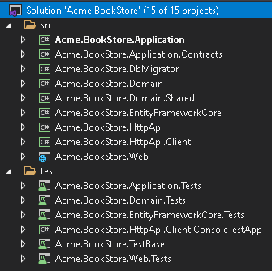

# 种子数据

## 介绍

使用数据库的某些应用程序(或模块),可能需要有一些**初始数据**才能​​够正常启动和运行. 例如**管理员用户**和角色必须在一开始就可用. 否则你就无法**登录**到应用程序创建新用户和角色.

数据种子也可用于[测试](Testing.md)的目的,你的自动测试可以假定数据库中有一些可用的初始数据.

### 为什么要有种子数据系统?

尽管EF Core Data Seeding系统提供了一种方法,但它非常有限,不包括生产场景. 此外它仅适用于EF Core.

ABP框架提供了种子数据系统;

* **模块化**: 任何[模块](Module-Development-Basics.md)都可以无声地参与数据播种过程,而不相互了解和影响. 通过这种方式模块将种子化自己的初始数据.
* **数据库独立**: 它不仅适用于 EF Core, 也使用其他数据库提供程序(如 [MongoDB](MongoDB.md)).
* **生产准备**: 它解决了生产环境中的问题. 参见下面的*On Production*部分.
* **依赖注入**: 它充分利用了依赖项注入,你可以在播种初始数据时使用任何内部或外部服务. 实际上你可以做的不仅仅是数据播种.

## IDataSeedContributor

将数据种子化到数据库需要实现 `IDataSeedContributor` 接口.

**示例: 如果没有图书,则向数据库播种一个初始图书**

````csharp
using System;
using System.Threading.Tasks;
using Volo.Abp.Data;
using Volo.Abp.DependencyInjection;
using Volo.Abp.Domain.Repositories;
using Volo.Abp.Guids;

namespace Acme.BookStore
{
    public class BookStoreDataSeedContributor
        : IDataSeedContributor, ITransientDependency
    {
        private readonly IRepository<Book, Guid> _bookRepository;
        private readonly IGuidGenerator _guidGenerator;
        private readonly ICurrentTenant _currentTenant;

        public BookStoreDataSeedContributor(
            IRepository<Book, Guid> bookRepository,
            IGuidGenerator guidGenerator,
            ICurrentTenant currentTenant)
        {
            _bookRepository = bookRepository;
            _guidGenerator = guidGenerator;
            _currentTenant = currentTenant;
        }
        
        public async Task SeedAsync(DataSeedContext context)
        {
            using (_currentTenant.Change(context?.TenantId))
            {
                if (await _bookRepository.GetCountAsync() > 0)
                {
                    return;
                }

                var book = new Book(
                    id: _guidGenerator.Create(),
                    name: "The Hitchhiker's Guide to the Galaxy",
                    type: BookType.ScienceFiction,
                    publishDate: new DateTime(1979, 10, 12),
                    price: 42
                );

                await _bookRepository.InsertAsync(book);
            }
        }
    }
}
````

* `IDataSeedContributor` 定义了 `SeedAsync` 方法用于执行  **数据种子逻辑**.
* 通常**检查数据库**是否已经存在种子数据.
* 你可以**注入**服务,检查数据播种所需的任何逻辑.

> 数据种子贡献者由ABP框架自动发现,并作为数据播种过程的一部分执行.

### DataSeedContext

如果你的应用程序是[多租户](Multi-Tenancy.md), `DataSeedContext` 包含 `TenantId`,因此你可以在插入数据或基于租户执行自定义逻辑时使用该值.

`DataSeedContext` 还包含用于从 `IDataSeeder` 传递到种子提供者的name-value配置参数.

## 模块化

一个应用程序可以具有多个种子数据贡献者(`IDataSeedContributor`)类. 任何可重用模块也可以实现此接口播种其自己的初始数据.

例如[Identity模块](Modules/Identity.md)有一个种子数据贡献者,它创建一个管理角色和管理用户并分配所有权限.

## IDataSeeder

> 通常你不需要直接使用 `IDataSeeder` 服务,因为如果你从[应用程序启动模板](Startup-Templates/Application.md)开始,该服务已经完成. 但是建议阅读以了解种子数据系统背后的设计.

`IDataSeeder` 是用于生成初始数据的主要服务. 使用它很容易;

````csharp
public class MyService : ITransientDependency
{
    private readonly IDataSeeder _dataSeeder;

    public MyService(IDataSeeder dataSeeder)
    {
        _dataSeeder = dataSeeder;
    }

    public async Task FooAsync()
    {
        await _dataSeeder.SeedAsync();
    }
}
````

你可以[注入](Dependency-Injection.md) `IDataSeeder` 并且在你需要时使用它初始化种子数据. 它内部调用 `IDataSeedContributor` 的实现去完成数据播种.

可以将命名的配置参数发送到 `SeedAsync` 方法,如下所示:

````csharp
await _dataSeeder.SeedAsync(
    new DataSeedContext()
        .WithProperty("MyProperty1", "MyValue1")
        .WithProperty("MyProperty2", 42)
);
````

然后种子数据提供者可以通过前面解释的 `DataSeedContext` 访问这些属性.

如果模块需要参数,应该在[模块文档](Modules/Index.md)中声明它. 例如[Identity Module](Modules/Identity.md)使用 `AdminEmail` 和 `AdminPassword` 参数,如果你提供了(默认使用默认值).

### 在何处以及如何播种数据?

重要的是要了解在何处以及如何执行 `IDataSeeder.SeedAsync()`.

#### On Production

[应用程序启动模板](Startup-Templates/Application.md)带有一个*YourProjectName***.DbMigrator** 项目(图中的Acme.BookStore.DbMigrator). 这是一个**控制台应用程序**,负责**迁移**数据库架构(关系数据库)和初始种子数据:



控制台应用程序已经为你正确配置,它甚至支持**多租户**场景,其中每个租户拥有自己的数据库(迁移和必须的数据库).

当你将解决方案的**新版本部署到服务器**时,都需要运行这个DbMigrator应用程序. 它会迁移你的**数据库架构**(创建新的表/字段…)和播种正确运行解决方案的新版本所需的**新初始数据**. 然后就可以部署/启动实际的应用程序了.

即使你使用的是MongoDB或其他NoSQL数据库(不需要进行架构迁移),也建议使用DbMigrator应用程序为你的数据添加种子或执行数据迁移.

有这样一个单独的控制台应用程序有几个优点;

* 你可以在更新你的应用程序**之前运行它**,所以你的应用程序可以在准备就绪的数据库上运行.
* 与本身初始化种子数据相比,你的应用程序**启动速度更快**.
* 应用程序可以在**集群环境**中正确运行(其中应用程序的多个实例并发运行). 在这种情况下如果在应用程序启动时播种数据就会有冲突.

#### On Development

我们建议以相同的方式进行开发. 每当你[创建数据库迁移](https://docs.microsoft.com/en-us/ef/ef6/modeling/code-first/migrations/)(例如使用EF Core `Add-Migration` 命令)或更改数据种子代码(稍后说明)时,请运行DbMigrator控制台应用程序.

> 你可以使用EF Core继续执行标准的 `Update-Database` 命令,但是它不会初始化种子数据.

#### On Testing

你可能想为自动[测试](Testing.md)初始化数据种子, 这需要使用 `IDataSeeder.SeedAsync()`. 在[应用程序启动模板](Startup-Templates/Application.md)中,它在TestBase项目的*YourProjectName*TestBaseModule类的[OnApplicationInitialization](Module-Development-Basics.md)方法中完成.

除了标准种子数据(也在生产中使用)之外,你可能还希望为自动测试添加其他种子数据. 你可以在测试项目中创建一个新的数据种子贡献者以处理更多数据.
