# Identity Management Module

Identity module is used to manage roles, users and their permissions, based on the [Microsoft Identity library](https://docs.microsoft.com/en-us/aspnet/core/security/authentication/identity).

## How to Install

This module comes as pre-installed (as NuGet/NPM packages) when you [create a new solution](https://abp.io/get-started) with the ABP Framework. You can continue to use it as package and get updates easily, or you can include its source code into your solution (see `get-source` [CLI](../CLI.md) command) to develop your custom module.

### The Source Code

The source code of this module can be accessed [here](https://github.com/abpframework/abp/tree/dev/modules/identity). The source code is licensed with [MIT](https://choosealicense.com/licenses/mit/), so you can freely use and customize it.

## User Interface

This module provides [Blazor](../UI/Blazor/Overall.md), [Angular](../UI/Angular/Quick-Start.md) and [MVC / Razor Pages](../UI/AspNetCore/Overall.md) UI options.

### Menu Items

This module adds an *Identity management* menu item under the *Administration* menu:

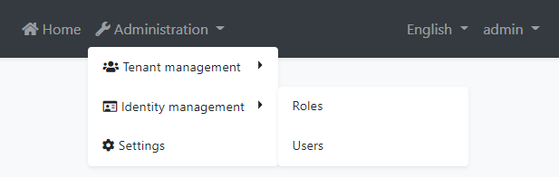

The menu items and the related pages are authorized. That means the current user must have the related permissions to make them visible. The `admin` role (and the users with this role - like the `admin` user) already has these permissions. If you want to enable permissions for other roles/users, open the *Permissions* dialog on the *Roles* or *Users* page and check the permissions as shown below:

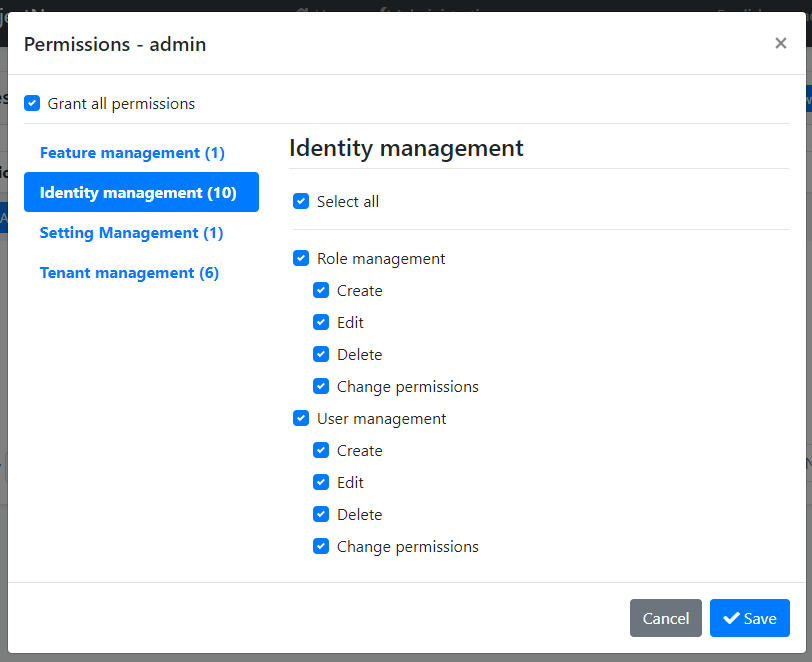

See the [Authorization document](../Authorization.md) to understand the permission system.

### Pages

This section introduces the main pages provided by this module.

#### Users

This page is used to see the list of users. You can create/edit and delete users, assign users to roles.

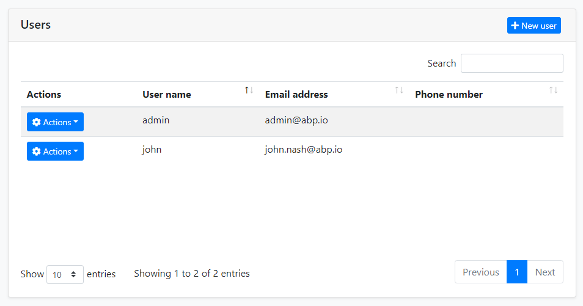

A user can have zero or more roles. Users inherit permissions from their roles. In addition, you can assign permissions directly to the users (by clicking the *Actions* button, then selecting the *Permissions*).

#### Roles

Roles are used to group permissions assign them to users.


Beside the role name, there are two properties of a role:

* `Default`: If a role is marked as "default", then that role is assigned to new users by default when they register to the application themselves (using the [Account Module](Account.md)).
* `Public`: A public role of a user can be seen by other users in the application. This feature has no usage in the Identity module, but provided as a feature that you may want to use in your own application.

## Other Features

This section covers some other features provided by this module which don't have the UI pages.

### Organization Units

Organization Units (OU) can be used to **hierarchically group users and entities**. 

#### OrganizationUnit Entity

An OU is represented by the **OrganizationUnit** entity. The fundamental properties of this entity are:

- **TenantId**: Tenant's Id of this OU. Can be null for host OUs.
- **ParentId**: Parent OU's Id. Can be null if this is a root OU.
- **Code**: A hierarchical string code that is unique for a tenant.
- **DisplayName**: Shown name of the OU.

#### Organization Tree

Since an OU can have a parent, all OUs of a tenant are in a **tree** structure. There are some rules for this tree;

- There can be more than one root (where the `ParentId` is `null`).
- There is a limit for the first-level children count of an OU (because of the fixed OU Code unit length explained below).

#### OU Code

OU code is automatically generated and maintained by the `OrganizationUnitManager` service. It's a string that looks something like this:

"**00001.00042.00005**"

This code can be used to easily query the database for all the children of an OU (recursively). There are some rules for this code (automatically applied when you use `OrganizationUnitManager`):

- It is **unique** for a [tenant](../Multi-Tenancy.md).
- All the children of the same OU have codes that **start with the parent OU's code**.
- It's **fixed length** and based on the level of the OU in the tree, as shown in the sample.
- While the OU code is unique, it can be **changed** if you move the related OU.

Notice that you must reference an OU by Id, not Code, because the Code can be changed later.

#### OrganizationUnit Manager

The `OrganizationUnitManager` class can be [injected](../Dependency-Injection.md) and used to manage OUs. Common use cases are:

- Create, Update or Delete an OU
- Move an OU in the OU tree.
- Getting information about the OU tree and its items.

### Identity Security Log

The security log system records some important operations or changes about your account (like *login* and *change password*). You can also save the security log if needed.

You can inject and use `IdentitySecurityLogManager` or `ISecurityLogManager` to write security logs. It will create a log object by default and fill in some common values, such as `CreationTime`, `ClientIpAddress`, `BrowserInfo`, `current user/tenant`, etc. Of course, you can override them.

```cs
await IdentitySecurityLogManager.SaveAsync(new IdentitySecurityLogContext()
{
	Identity = "IdentityServer";
	Action = "ChangePassword";
});
```

Configure `AbpSecurityLogOptions` to provide the application name (in case of you have multiple applications and want to distinguish the applications in the logs) for the log or disable this feature.

```cs
Configure<AbpSecurityLogOptions>(options =>
{
	options.ApplicationName = "AbpSecurityTest";
});
```

## Options

`IdentityOptions` is the standard [options class](../Options.md) provided by the Microsoft [Identity library](https://docs.microsoft.com/en-us/aspnet/core/security/authentication/identity). So, you can set these options in the `ConfigureServices` method of your [module](../Module-Development-Basics.md) class.

**Example: Set minimum required length of passwords**

````csharp
Configure<IdentityOptions>(options =>
{
    options.Password.RequiredLength = 5;
});
````

ABP takes these options one step further and allows you to change them on runtime by using the [setting system](../Settings.md). You can [inject](../Dependency-Injection.md) `ISettingManager` and use one of the `Set...` methods to change the option values for a user, a tenant or globally for all users.

**Example: Change minimum required length of passwords for the current tenant**

````csharp
public class MyService : ITransientDependency
{
    private readonly ISettingManager _settingManager;

    public MyService(ISettingManager settingManager)
    {
        _settingManager = settingManager;
    }

    public async Task ChangeMinPasswordLength(int minLength)
    {
        await _settingManager.SetForCurrentTenantAsync(
            IdentitySettingNames.Password.RequiredLength,
            minLength.ToString()
        );
    }
}
````

`IdentitySettingNames` class (in the `Volo.Abp.Identity.Settings` namespace) defines constants for the setting names.

## Distributed Events

This module defines the following ETOs (Event Transfer Objects) to allow you to subscribe to changes on the entities of the module;

* `UserEto` is published on changes done on an `IdentityUser` entity.
* `IdentityRoleEto` is published on changes done on an `IdentityRole` entity.
* `IdentityClaimTypeEto` is published on changes done on an `IdentityClaimType` entity.
* `OrganizationUnitEto` is published on changes done on an `OrganizationUnit` entity.

**Example: Get notified when a new user has been created**

````csharp
public class MyHandler :
    IDistributedEventHandler<EntityCreatedEto<UserEto>>,
    ITransientDependency
{
    public async Task HandleEventAsync(EntityCreatedEto<UserEto> eventData)
    {
        UserEto user = eventData.Entity;
        // TODO: ...
    }
}
````

`UserEto` and `IdentityRoleEto` are configured to automatically publish the events. You should configure yourself for the others. See the [Distributed Event Bus document](../Distributed-Event-Bus.md) to learn details of the pre-defined events.

> Subscribing to the distributed events is especially useful for distributed scenarios (like microservice architecture). If you are building a monolithic application, or listening events in the same process that runs the Identity Module, then subscribing to the [local events](../Local-Event-Bus.md) can be more efficient and easier.

## Internals

This section covers some internal details of the module that you don't need much, but may need to use in some cases.

### Domain layer

#### Aggregates

##### User

A user is generally a person logins to and uses the application.

* `IdentityUser` (aggregate root): Represents a user in the system.
  * `IdentityUserRole` (collection): Roles to the user.
  * `IdentityUserClaim` (collection): Custom claims of the user.
  * `IdentityUserLogin` (collection): External logins of the user.
  * `IdentityUserToken` (collection): Tokens of the user (used by the Microsoft Identity services).

##### Role

A role is typically a group of permissions to assign to the users.

* `IdentityRole` (aggregate root): Represents a role in the system.
  * `IdentityRoleClaim` (collection): Custom claims of the role.

##### Claim Type

A claim type is a definition of a custom claim that can be assigned to other entities (like roles and users) in the system.

* `IdentityClaimType` (aggregate root): Represents a claim type definition. It contains some properties (e.g. Required, Regex, Description, ValueType) to define the claim type and the validation rules.

##### Identity Security Log

A `IdentitySecurityLog` object represents an authentication related operation (like *login*) in the system.

* `IdentitySecurityLog` (aggregate root): Represents a security log in the system.

##### OrganizationUnit

An Organization unit is a entity in a hierarchical structure.

* ```OrganizationUnit``` (aggregate root): Represents an organization unit in the system.
  * ```Roles``` (collection): Roles of the organization unit.

#### Repositories

Following custom repositories are defined for this module:

* `IIdentityUserRepository`
* `IIdentityRoleRepository`
* `IIdentityClaimTypeRepository`
* ```IIdentitySecurityLogRepository```
* ```IOrganizationUnitRepository```

#### Domain services

##### User manager

`IdentityUserManager` is used to manage users, their roles, claims, passwords, emails, etc. It is derived from Microsoft Identity's `UserManager<T>` class where `T` is `IdentityUser`.

##### Role manager

`IdentityRoleManager` is used to manage roles and their claims. It is derived from Microsoft Identity's `RoleManager<T>` class where `T` is `IdentityRole`.

##### Claim type manager

`IdenityClaimTypeManager` is used to perform some operations for the `IdentityClaimType` aggregate root.

##### Organization unit manager

```OrganizationUnitManager``` is used to perform some operations for the ```OrganizationUnit``` aggregate root.

##### Security log manager

```IdentitySecurityLogManager``` is used to save security logs.

### Application Layer

#### Application Services

* `IdentityUserAppService` (implements `IIdentityUserAppService`): Implements the use cases of the user management UI.
* `IdentityRoleAppService` (implement `IIdentityRoleAppService`): Implements the use cases of the role management UI.
* `IdentityClaimTypeAppService` (implements `IIdentityClaimTypeAppService`): Implements the use cases of the claim type management UI.
* `IdentitySettingsAppService` (implements `IIdentitySettingsAppService`): Used to get and update settings for the Identity module.
* `IdentityUserLookupAppService` (implements `IIdentityUserLookupAppService`): Used to get information for a user by `id` or `userName`. It is aimed to be used internally by the ABP framework.
* `ProfileAppService` (implements `IProfileAppService`): Used to change a user's profile and the password.
* ```IdentitySecurityLogAppService``` (implements ```IIdentitySecurityLogAppService```): Implements the use cases of the security logs UI.
* ```OrganizationUnitAppService``` (implements ```OrganizationUnitAppService```): Implements the use cases of the organization unit management UI.

### Database Providers

This module provides [Entity Framework Core](../Entity-Framework-Core.md) and [MongoDB](../MongoDB.md) options for the database.

#### Entity Framework Core

[Volo.Abp.Identity.EntityFrameworkCore](https://www.nuget.org/packages/Volo.Abp.Identity.EntityFrameworkCore) NuGet package implements the EF Core integration.

##### Database Tables

* **AbpRoles**
  * AbpRoleClaims
* **AbpUsers**
  * AbpUserClaims
  * AbpUserLogins
  * AbpUserRoles
  * AbpUserTokens
* **AbpClaimTypes**
* **AbpOrganizationUnits**
  * AbpOrganizationUnitRoles
  * AbpUserOrganizationUnits
* **AbpSecurityLogs**

#### MongoDB

[Volo.Abp.Identity.MongoDB](https://www.nuget.org/packages/Volo.Abp.Identity.MongoDB) NuGet package implements the MongoDB integration.

##### Database Collections

* **AbpRoles**
* **AbpUsers**
* **AbpClaimTypes**
* **AbpOrganizationUnits**
* **AbpSecurityLogs**

#### Common Database Properties

You can set the following properties of the `AbpIdentityDbProperties` class to change the database options:

* `DbTablePrefix` (`Abp` by default) is the prefix for table/collection names.
* `DbSchema` (`null` by default) is the database schema.
* `ConnectionStringName` (`AbpIdentity` by default) is the [connection string](../Connection-Strings.md) name for this module.

These are static properties. If you want to set, do it in the beginning of your application (typically, in `Program.cs`).

---

# Identity module (Commercial)

This module implements the User and Role system of an application;

* Built on the [Microsoft's ASP.NET Core Identity](https://docs.microsoft.com/en-us/aspnet/core/security/authentication/identity) library.
* Manage **roles** and **users** in the system. A user is allowed to have **multiple roles**.
* Set **permissions** in role and user levels.
* Enable/disable **two factor authentication** and user **lockout** per user.
* Manage basic **user profile** and **password**.
* Manage **claim types** in the system, set claims to roles and users.
* Setting page to manage **password complexity**, user sign-in, account and lockout.
* Supports **LDAP** authentication.
* Provides **email & phone number** verification.
* Supports social login integrations (Twitter, Facebook, GitHub etc...).
* Manage **organization units** in the system.
* View security logs (login, logout, change password...) in the system.

See [the module description page](https://commercial.abp.io/modules/Volo.Identity.Pro) for an overview of the module features.

## How to install

Identity is pre-installed in [the startup templates](../startup-templates/application/index.md). So, no need to manually install it.

## Packages

This module follows the [module development best practices guide](https://docs.abp.io/en/abp/latest/Best-Practices/Index) and consists of several NuGet and NPM packages. See the guide if you want to understand the packages and relations between them.

You can visit [Identity module package list page](https://abp.io/packages?moduleName=Volo.Identity.Pro) to see list of packages related with this module.

## User interface

### Menu items

Identity module adds the following items to the "Main" menu, under the "Administration" menu item:

* **Roles**: Role management page.
* **Users**: User management page.
* **Claim Types**: Claim type management page.
* **Organization Units**: Organization unit management page.
* **Security Logs**: Security log search page.

`IdentityMenuNames` class has the constants for the menu item names.

### Pages

#### Role management

Roles page is used to manage roles in the system. A role is a set of permissions assigned to the users.

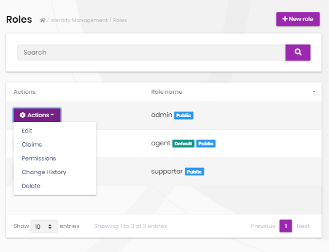

You can create a new role or edit a role in this page:

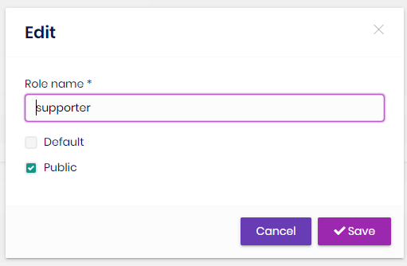

* **Default** roles are assigned to new users by default.
* **Public** roles are visible to other users.

##### Role permissions

You can manage permissions of a role:

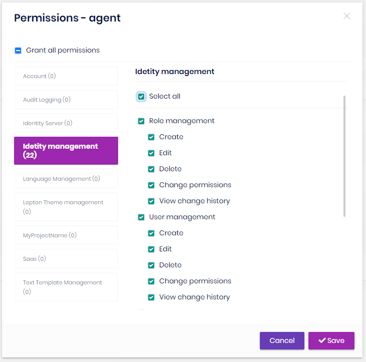

* A permission is an **action of the application** granted to roles and users.
* A user with a role will **inherit** all the permissions granted for the role.
* Any module can **[define permissions](https://docs.abp.io/en/abp/latest/Authorization#permission-system)**. Once you define a new permission, it will be available in this page.
* Left side is the **list of modules**. Once you click to a module name, you can check/uncheck permissions related to that module.

##### Role claims

You can set custom claim values for a role:

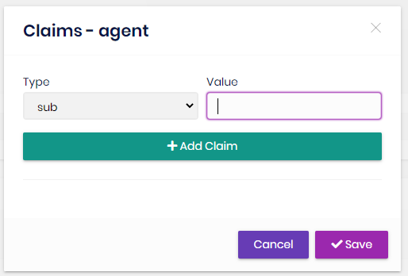

Claim types are retrieved from the claim list defined in the Claim Types  Management page (see below).

#### User management

Users page is used to manage the users in your system.

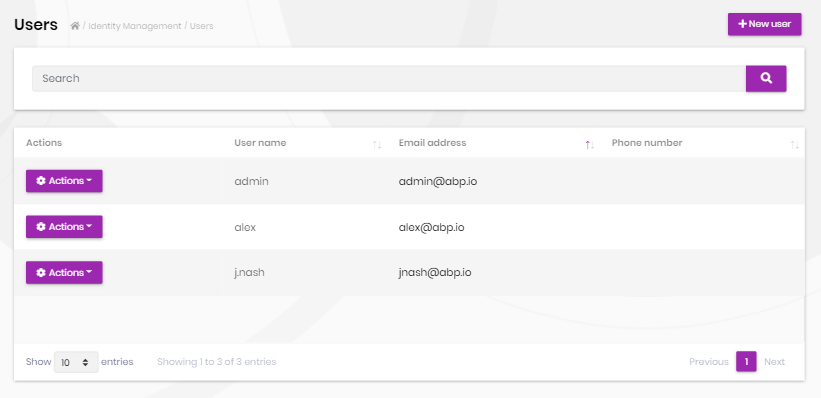

You can create a new user or edit an existing user in this page:

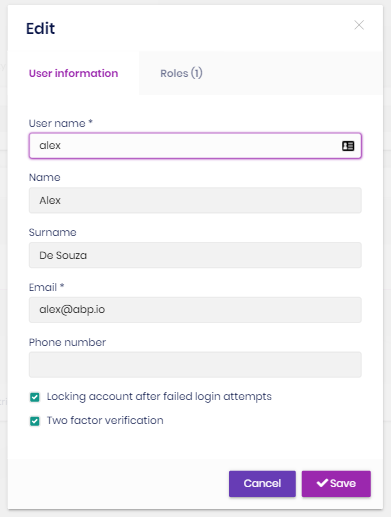

* A user can have **zero or more roles** in the system.
* You can set **two factor** verification and user **lockout** settings per user.

##### User permissions

A user has union of the permissions of the assigned roles. Identity module also allows to grant extra permissions to a specific user.

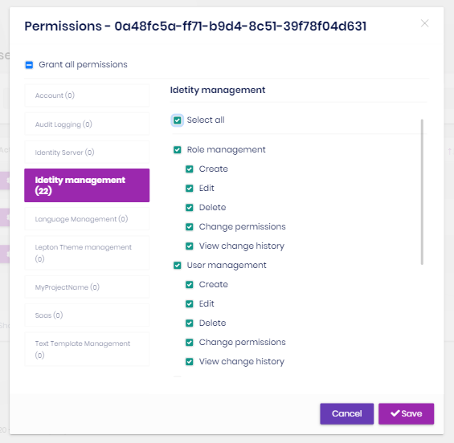

##### User claims

You can also set custom claim values for a user:

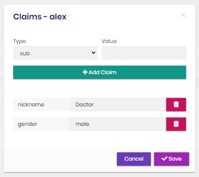

Claim types are retrieved from the claim list defined in the Claim Type Management page (see below).

#### Claim type management

Identity module allows to define custom claim types.

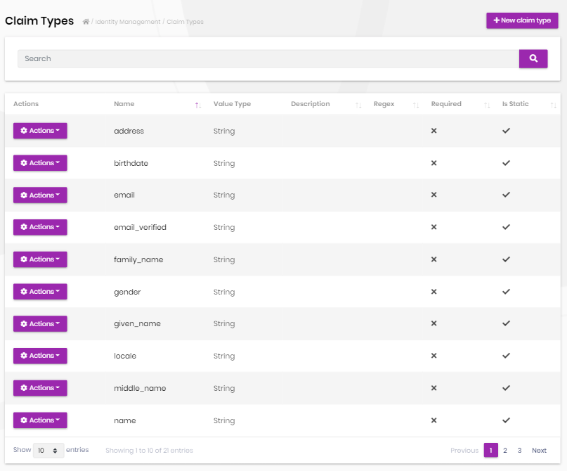

* Custom claims can be used to store additional information to a user or role.
* Custom claim values then can be accessed in the application code for an authenticated user.
* Claim Types are also used by the Identity Server module if you're using it.

#### Identity module settings UI

Identity module adds a new tab to the Settings page to customize the behavior on runtime.

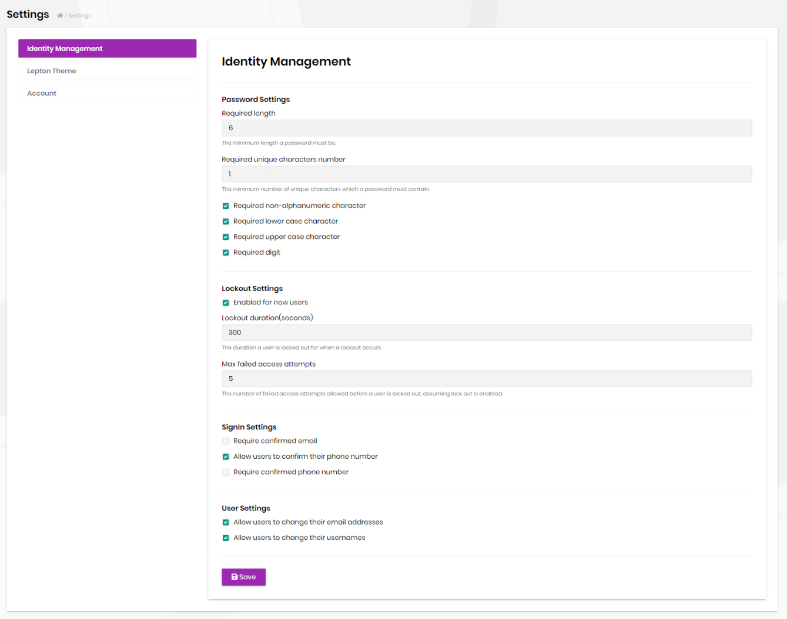

### Organization Units

Organization units page is used to manage organization units, members of organization units and roles of organization units.

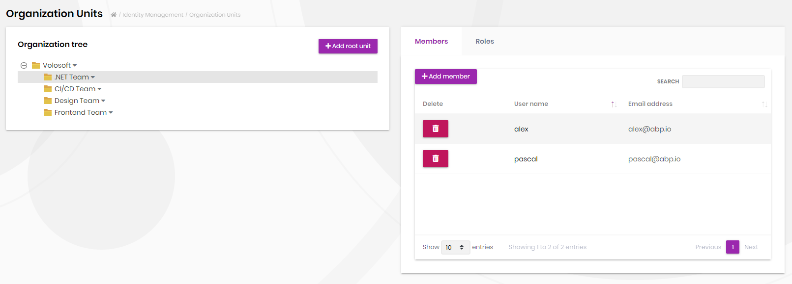

You can add a new organization unit or edit an existing organization unit on this page. In order to add a new root organization unit, click "Add root unit" button and fill the opening form.


In order to add a sub-unit to an existing organization unit, right click on an existing organization unit and click "Add sub-unit" context menu item. Similarly, in order to edit an organization unit, right click on an existing organization unit and click "Edit" context menu item.

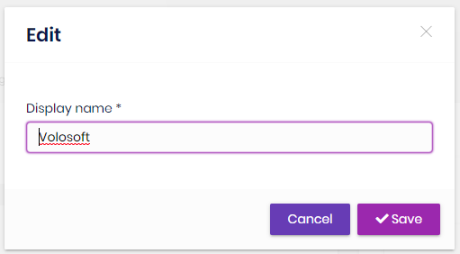

You can manage members of an organization unit using the members tab by selection an organization unit or by right clicking to an item on the organization unit tree.

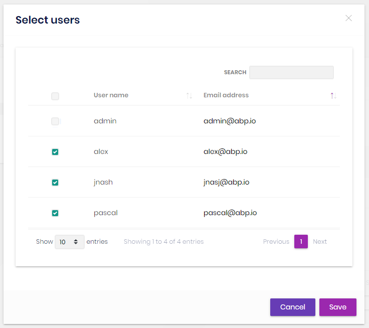

You can manage roles of an organization unit using the members tab or by right clicking to an item on the organization unit tree. An organization unit inherits permissions of its roles.

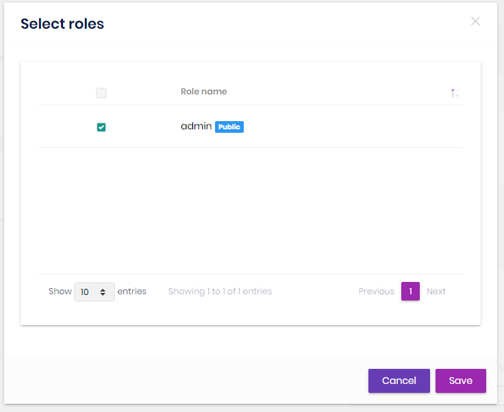

### Security Logs

Security logs page is used to search and view authentication related operations (login, logout, change password...) in the system.

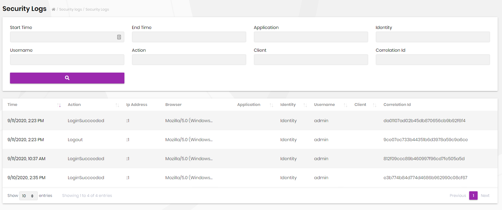

Also, each user can view security logs for his/her account as shown in the screenshot below;

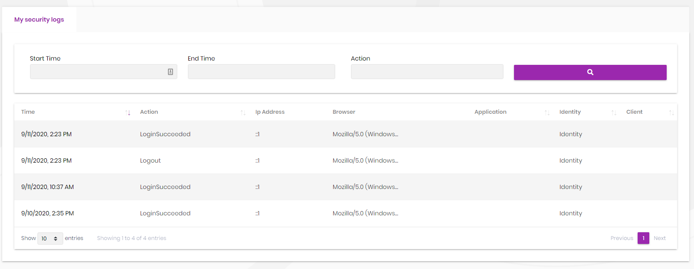

## Data seed

This module adds some initial data (see [the data seed system](https://docs.abp.io/en/abp/latest/Data-Seeding)) to the database when you run the `.DbMigrator` application:

* Creates an `admin` role with all the permissions granted.
* Creates an `admin` user with the `admin` role and `1q2w3E*` as the password.

You normally change this password when you first run the application in your production environment. But if you want to change the password of the seed data, find the *ProjectName*DbMigrationService in your solution, locate to the `MigrateAsync` method. There will be a line like that:

````csharp
await _dataSeeder.SeedAsync();
````

Change it like that:

````csharp
await _dataSeeder.SeedAsync(
    new DataSeedContext()
        .WithProperty("AdminPassword", "myPassW00rd42")
);
````

Just like the password, you can also set the admin email (use the `AdminEmail` key in this case).

> The [data seed contributor](https://docs.abp.io/en/abp/latest/Data-Seeding) class of the Identity module is `IdentityDataSeedContributor` which internally uses the `IIdentityDataSeeder` service.

## Options

### AbpIdentityAspNetCoreOptions

`AbpIdentityAspNetCoreOptions` can be configured in the UI layer, in the `ConfigureServices` method of your [module](https://docs.abp.io/en/abp/latest/Module-Development-Basics). Example:

````csharp
Configure<AbpIdentityAspNetCoreOptions>(options =>
{
    //Set options here...
});
````

`AbpIdentityAspNetCoreOptions` properties:

* `ConfigureAuthentication` (default: true): Identity module calls `AddAuthentication` and `AddIdentityCookies` extension methods by default to configure the authentication for the Identity library. It sets `DefaultScheme` to `IdentityConstants.ApplicationScheme` and `DefaultSignInScheme` to `IdentityConstants.ExternalScheme`. You can set this property to `false` to suppress it and configure it yourself.

## Internals

### Domain layer

#### Aggregates

This module follows the [Entity Best Practices & Conventions](https://docs.abp.io/en/abp/latest/Best-Practices/Entities) guide.

##### User

A user is generally a person logins to and uses the application.

* `IdentityUser` (aggregate root): Represents a user in the system.
  * `IdentityUserRole` (collection): Roles to the user.
  * `IdentityUserClaim` (collection): Custom claims of the user.
  * `IdentityUserLogin` (collection): External logins of the user.
  * `IdentityUserToken` (collection): Tokens of the user (used by the Microsoft Identity services).

##### Role

A role is typically a group of permissions to assign to the users.

* `IdentityRole` (aggregate root): Represents a role in the system.
  * `IdentityRoleClaim` (collection): Custom claims of the role.

##### Claim type

A claim type is a definition of a custom claim that can be assigned to other entities (like roles and users) in the system.

* `IdentityClaimType` (aggregate root): Represents a claim type definition. It contains some properties (e.g. Required, Regex, Description, ValueType) to define the claim type and the validation rules.

##### Identity Security Log

A IdentitySecurityLog represents an authentication related operation in the system.

* ```IdentitySecurityLog``` (aggregate root): Represents a security log in the system.

##### OrganizationUnit

An Organization unit is a entity in a hierarchical structure.

* ```OrganizationUnit``` (aggregate root): Represents an organization unit in the system.
  * ```Roles``` (collection): Roles of the organization unit.

#### Repositories

This module follows the [Repository Best Practices & Conventions](https://docs.abp.io/en/abp/latest/Best-Practices/Repositories) guide.

Following custom repositories are defined for this module:

* `IIdentityUserRepository`
* `IIdentityRoleRepository`
* `IIdentityClaimTypeRepository`
* ```IIdentitySecurityLogRepository```
* ```IOrganizationUnitRepository```

#### Domain services

This module follows the [Domain Services Best Practices & Conventions]( https://docs.abp.io/en/abp/latest/Best-Practices/Domain-Services) guide.

##### User manager

`IdentityUserManager` is used to manage users, their roles, claims, passwords, emails, etc. It is derived from Microsoft Identity's `UserManager<T>` class where `T` is `IdentityUser`.

##### Role manager

`IdentityRoleManager` is used to manage roles and their claims. It is derived from Microsoft Identity's `RoleManager<T>` class where `T` is `IdentityRole`.

##### Claim type manager

`IdenityClaimTypeManager` is used to perform some operations for the `IdentityClaimType` aggregate root.

##### Organization unit manager

```OrganizationUnitManager``` is used to perform some operations for the ```OrganizationUnit``` aggregate root.

##### Security log manager

```IdentitySecurityLogManager``` is used to save security logs.

### Settings

See the `IdentitySettingNames` class members for all settings defined for this module.

### Application layer

#### Application services

* `IdentityUserAppService` (implements `IIdentityUserAppService`): Implements the use cases of the user management UI.
* `IdentityRoleAppService` (implement `IIdentityRoleAppService`): Implements the use cases of the role management UI.
* `IdentityClaimTypeAppService` (implements `IIdentityClaimTypeAppService`): Implements the use cases of the claim type management UI.
* `IdentitySettingsAppService` (implements `IIdentitySettingsAppService`): Used to get and update settings for the Identity module.
* `IdentityUserLookupAppService` (implements `IIdentityUserLookupAppService`): Used to get information for a user by `id` or `userName`. It is aimed to be used internally by the ABP framework.
* `ProfileAppService` (implements `IProfileAppService`): Used to change a user's profile and the password.
* ```IdentitySecurityLogAppService``` (implements ```IIdentitySecurityLogAppService```): Implements the use cases of the security logs UI.
* ```OrganizationUnitAppService``` (implements ```OrganizationUnitAppService```): Implements the use cases of the organization unit management UI.

### Database providers

#### Common

##### Table / collection prefix & schema

All tables/collections use the `Abp` prefix by default. Set static properties on the `AbpIdentityDbProperties` class if you need to change the table prefix or set a schema name (if supported by your database provider).

##### Connection string

This module uses `AbpIdentity` for the connection string name. If you don't define a connection string with this name, it fallbacks to the `Default` connection string.

See the [connection strings](https://docs.abp.io/en/abp/latest/Connection-Strings) documentation for details.

#### Entity Framework Core

##### Tables

* **AbpRoles**
  * AbpRoleClaims
* **AbpUsers**
  * AbpUserClaims
  * AbpUserLogins
  * AbpUserRoles
  * AbpUserTokens
* **AbpClaimTypes**
* **AbpOrganizationUnits**
  * AbpOrganizationUnitRoles
  * AbpUserOrganizationUnits
* **AbpSecurityLogs**

#### MongoDB

##### Collections

* **AbpRoles**
* **AbpUsers**
* **AbpClaimTypes**
* **AbpOrganizationUnits**
* **AbpSecurityLogs**

### Permissions

See the `IdentityPermissions` class members for all permissions defined for this module.

### Angular UI

#### Installation

In order to configure the application to use the `IdentityModule`, you first need to import `IdentityConfigModule` from `@volo/abp.ng.identity/config` to root module. `IdentityConfigModule` has a static `forRoot` method which you should call for a proper configuration.

```js
// app.module.ts
import { IdentityConfigModule } from '@volo/abp.ng.identity/config';

@NgModule({
  imports: [
    // other imports
    IdentityConfigModule.forRoot(),
    // other imports
  ],
  // ...
})
export class AppModule {}
```

The `IdentityModule` should be imported and lazy-loaded in your routing module. It has a static `forLazy` method for configuration. Available options are listed below. It is available for import from `@volo/abp.ng.identity`.

```js
// app-routing.module.ts
const routes: Routes = [
  // other route definitions
  {
    path: 'identity',
    loadChildren: () =>
      import('@volo/abp.ng.identity').then(m => m.IdentityModule.forLazy(/* options here */)),
  },
];

@NgModule(/* AppRoutingModule metadata */)
export class AppRoutingModule {}
```

> If you have generated your project via the startup template, you do not have to do anything, because it already has both `IdentityConfigModule` and `IdentityModule`.

<h4 id="h-identity-module-options">Options</h4>

You can modify the look and behavior of the module pages by passing the following options to `IdentityModule.forLazy` static method:

- **entityActionContributors:** Changes grid actions. Please check [Entity Action Extensions for Angular](https://docs.abp.io/en/abp/latest/UI/Angular/Entity-Action-Extensions) for details.
- **toolbarActionContributors:** Changes page toolbar. Please check [Page Toolbar Extensions for Angular](https://docs.abp.io/en/abp/latest/UI/Angular/Page-Toolbar-Extensions) for details.
- **entityPropContributors:** Changes table columns. Please check [Data Table Column Extensions for Angular](https://docs.abp.io/en/abp/latest/UI/Angular/Data-Table-Column-Extensions) for details.
- **createFormPropContributors:** Changes create form fields. Please check [Dynamic Form Extensions for Angular](https://docs.abp.io/en/abp/latest/UI/Angular/Dynamic-Form-Extensions) for details.
- **editFormPropContributors:** Changes create form fields. Please check [Dynamic Form Extensions for Angular](https://docs.abp.io/en/abp/latest/UI/Angular/Dynamic-Form-Extensions) for details.

#### Services / Models

Identity module services and models are generated via `generate-proxy` command of the [ABP CLI](https://docs.abp.io/en/abp/latest/CLI). If you need the module's proxies, you can run the following command in the Angular project directory:

```bash
abp generate-proxy --module identity
```


#### Replaceable Components

`eIdentityComponents` enum provides all replaceable component keys. It is available for import from `@volo/abp.ng.identity`.

Please check [Component Replacement document](https://docs.abp.io/en/abp/latest/UI/Angular/Component-Replacement) for details.


#### Remote Endpoint URL

The Identity module remote endpoint URL can be configured in the environment files.

```js
export const environment = {
  // other configurations
  apis: {
    default: {
      url: 'default url here',
    },
    AbpIdentity: {
      url: 'Identity remote url here'
    }
    // other api configurations
  },
};
```

The Identity module remote URL configuration shown above is optional. If you don't set a URL, the `default.url` will be used as fallback.

## Distributed Events

This module doesn't define any additional distributed event. See the [standard distributed events](https://docs.abp.io/en/abp/latest/Distributed-Event-Bus).
