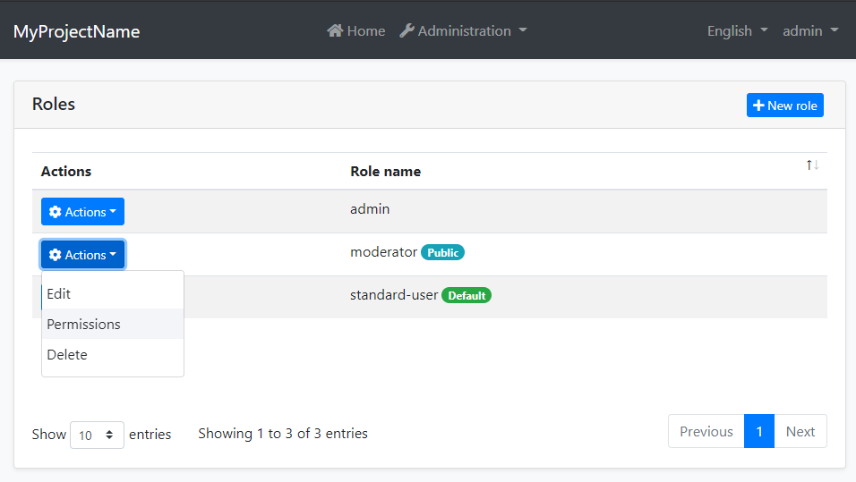
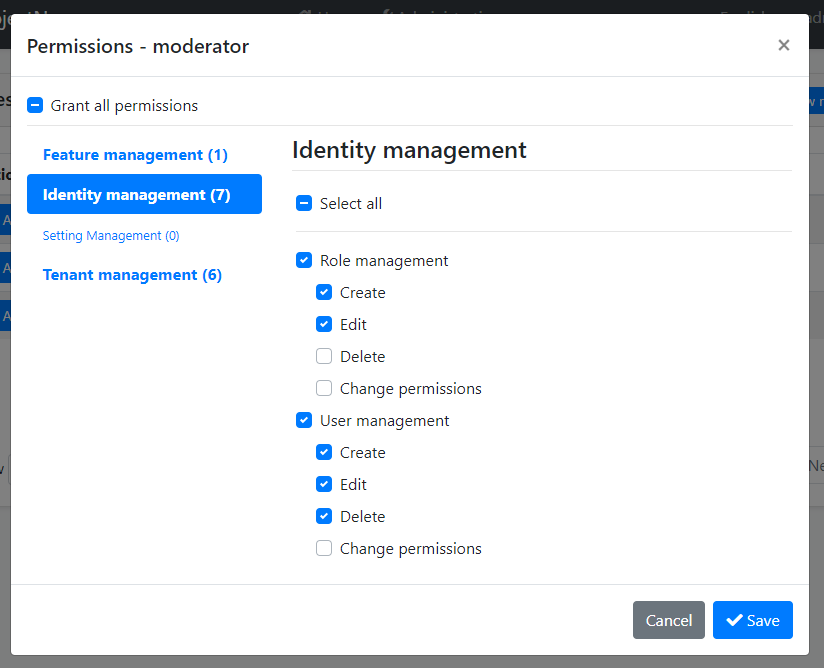

# Permission Management Module

This module implements the `IPermissionStore` to store and manage permissions values in a database.

> This document covers only the permission management module which persists permission values to a database. See the [Authorization document](../Authorization.md) to understand the authorization and permission systems.

## How to Install

This module comes as pre-installed (as NuGet/NPM packages) when you [create a new solution](https://abp.io/get-started) with the ABP Framework. You can continue to use it as package and get updates easily, or you can include its source code into your solution (see `get-source` [CLI](../CLI.md) command) to develop your custom module.

### The Source Code

The source code of this module can be accessed [here](https://github.com/abpframework/abp/tree/dev/modules/permission-management). The source code is licensed with [MIT](https://choosealicense.com/licenses/mit/), so you can freely use and customize it.

## User Interface

### Permission Management Dialog

Permission management module provides a reusable dialog to manage permissions related to an object. For example, the [Identity Module](Identity.md) uses it to manage permissions of users and roles. The following image shows Identity Module's Role Management page:



When you click *Actions* -> *Permissions* for a role, the permission management dialog is opened. An example screenshot from this dialog:



In this dialog, you can grant permissions for the selected role. The tabs in the left side represents main permission groups and the right side contains the permissions defined in the selected group.

## IPermissionManager

`IPermissionManager` is the main service provided by this module. It is used to read and change the permission values. `IPermissionManager` is typically used by the *Feature Management Dialog*. However, you can inject it if you need to set a permission value.

> If you just want to read/check permission values for the current user, use the `IAuthorizationService` or the `[Authorize]` attribute as explained in the [Authorization document](../Authorization.md).

**Example: Grant permissions to roles and users using the `IPermissionManager` service**

````csharp
public class MyService : ITransientDependency
{
    private readonly IPermissionManager _permissionManager;

    public MyService(IPermissionManager permissionManager)
    {
        _permissionManager = permissionManager;
    }

    public async Task GrantRolePermissionDemoAsync(
        string roleName, string permission)
    {
        await _permissionManager
            .SetForRoleAsync(roleName, permission, true);
    }

    public async Task GrantUserPermissionDemoAsync(
        Guid userId, string roleName, string permission)
    {
        await _permissionManager
            .SetForUserAsync(userId, permission, true);
    }
}
````

## Permission Management Providers

Permission Management Module is extensible, just like the [permission system](../Authorization.md).  You can extend it by defining permission management providers.

[Identity Module](Identity.md) defines the following permission management providers:

* `UserPermissionManagementProvider`: Manages user-based permissions.
* `RolePermissionManagementProvider`: Manages role-based permissions.

`IPermissionManager` uses these providers when you get/set permissions. You can define your own provider by implementing the `IPermissionManagementProvider` or inheriting from the `PermissionManagementProvider` base class.

**Example:**

````csharp
public class CustomPermissionManagementProvider : PermissionManagementProvider
{
    public override string Name => "Custom";

    public CustomPermissionManagementProvider(
        IPermissionGrantRepository permissionGrantRepository,
        IGuidGenerator guidGenerator,
        ICurrentTenant currentTenant)
        : base(
            permissionGrantRepository,
            guidGenerator,
            currentTenant)
    {
    }
}
````

`PermissionManagementProvider` base class makes the default implementation (using the `IPermissionGrantRepository`) for you. You can override base methods as you need. Every provider must have a unique name, which is `Custom` in this example (keep it short since it is saved to database for each feature value record).

Once you create your provider class, you should register it using the `FeatureManagementOptions` [options class](../Options.md):

````csharp
Configure<PermissionManagementOptions>(options =>
{
    options.ManagementProviders.Add<CustomPermissionManagementProvider>();
});
````

The order of the providers are important. Providers are executed in the reverse order. That means the `CustomPermissionManagementProvider` is executed first for this example. You can insert your provider in any order in the `Providers` list.

## See Also

* [Authorization](../Authorization.md)
